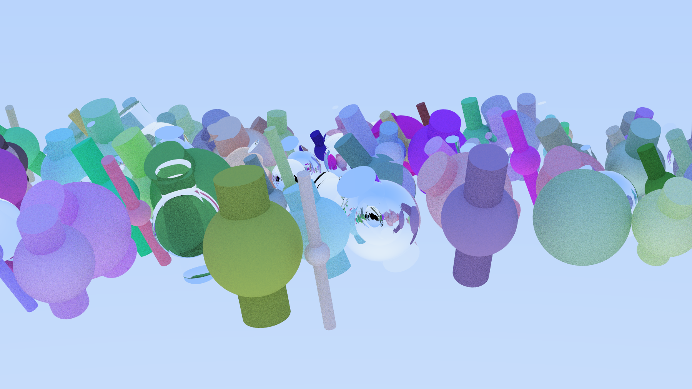
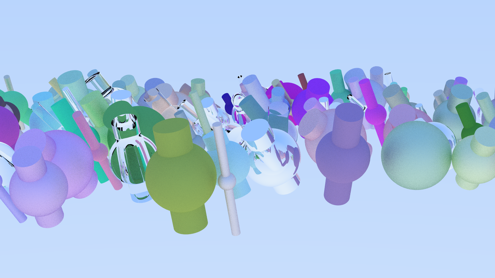
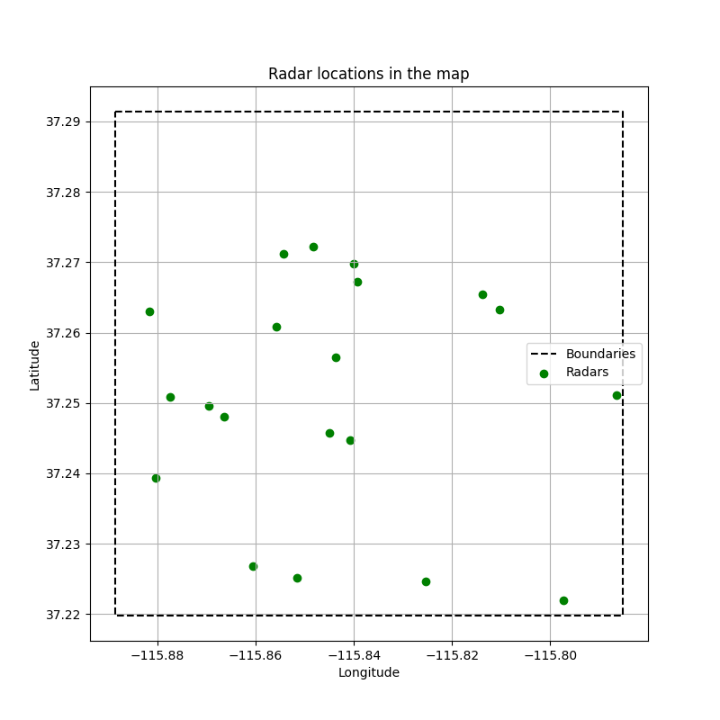
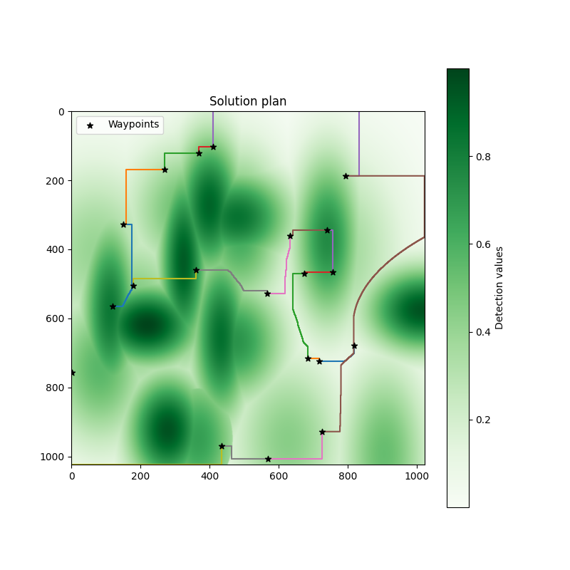

# Hi! I'm Montse 

### Third year Computer Science and Engineering student at Univeridad Carlos III de Madrid
Some things about me...
  - I consider myself a curious mind that loves problem solving.
  - Interested in learning about new topics and expanding my knowledge.
  - Looking to participate in different projects to gain experience and sharpen my skills. 

---

**Programming languages**

**Other languages**

**Tools**

---

## Some of my favorite University Projects :)
You can find their code -- and other projects too -- in my repository called Uni.

### [3D Image Render – Computer Architecture]()
> Performance-oriented 3D rendering engine that ray-traces scenes with spheres and cylinders, supporting matte, metallic and refractive materials. Output in PPM format.  
> `C++23` `CMake` `GoogleTest`
- Implemented two memory layouts (AOS vs SOA) and benchmarked their impact on cache performance and energy consumption using `perf`
- Applied sequential optimisation techniques: data layout tuning, compiler flags, and scalar code profiling — no multithreading allowed
- Full ray-tracing pipeline: viewport projection, multi-sample anti-aliasing, gamma correction, and recursive light bouncing

  
  
<em>Teacher's Version</em>
 
  
  
<em>My group's Version</em>
 

### [App for sharing notes between students - Cryptography & Security]()
> Secure application implementing a full cryptographic stack: user authentication, symmetric/asymmetric encryption, digital signatures, HMAC, and a custom PKI hierarchy.  
> `Python` `cryptography`
- Built user registration with password hashing and key derivation; symmetric encryption with AES and asymmetric with RSA/ECC using industry-standard key lengths
- Implemented HMAC-based message authentication and RSA/ECDSA digital signature generation and verification
- Deployed a multi-level Public Key Infrastructure (root CA + subordinate CA) to authenticate public keys via X.509 certificates

### [Heuristic Search in Radar Fields – Introduction to AI]()
> Route planning system for a stealth spy plane navigating a radar-covered map using A* and custom admissible heuristics.  
> `Python` `NumPy` `NetworkX`
- Built a detection probability map using the radar equation, multivariate Gaussian distributions, and MinMax scaling
- Modelled the search space as a weighted graph and integrated A* (`networkx.astar_path`) with two custom admissible heuristics
- Implemented high-level POI sequencing combined with local path planning to minimise total radar exposure
 
